# MMA Analytics
An analysis of 23 years of MMA outcomes in the Ultimate Fighting
Championship (UFC)

There was a total of 3,569 fights between 1,561 fighters. The fights
ranged from November 12th, 1993 up to February
21st, 2016.

The complete R code for this project can be found on my [Github
Site](www.github.com/bashkeel). The data was scraped by a 3rd party from
the Sherdog website. It can be found
[here](https://www.reddit.com/r/datasets/comments/47a7wh/ufc_fights_and_fighter_data/).

 

Striking versus Grappling: How do fighters win in MMA?
------------------------------------------------------

Most fights are won through striking, followed by chokes and jointlocks.
Regardless of the method of finish, a significant majority of fights are
won within the first round.

If a fight doesn't end within the designated number of rounds (3 round
for normal fights, 5 for championship or main event fights), the
decision goes to the judges score card. Decision wins were excluded from
this graph, but an analysis of decision wins can be found in the
supplementary section. No Contest wins were also excluded. The resulting
list of finishes included 2,044 fights.

 

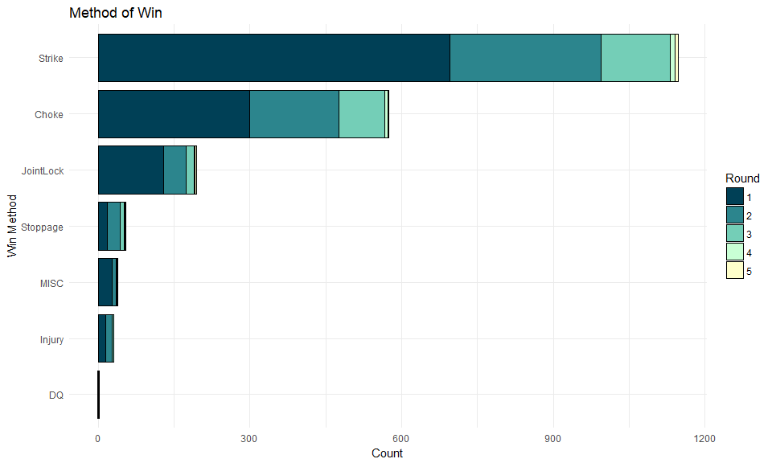

<table>
<thead>
<tr class="header">
<th align="left">Category</th>
<th align="left">1</th>
<th align="left">2</th>
<th align="left">3</th>
<th align="left">4</th>
<th align="left">5</th>
</tr>
</thead>
<tbody>
<tr class="odd">
<td align="left">Strike</td>
<td align="left">696</td>
<td align="left">299</td>
<td align="left">136</td>
<td align="left">10</td>
<td align="left">6</td>
</tr>
<tr class="even">
<td align="left">Choke</td>
<td align="left">299</td>
<td align="left">177</td>
<td align="left">91</td>
<td align="left">7</td>
<td align="left">1</td>
</tr>
<tr class="odd">
<td align="left">JointLock</td>
<td align="left">130</td>
<td align="left">44</td>
<td align="left">16</td>
<td align="left">1</td>
<td align="left">4</td>
</tr>
<tr class="even">
<td align="left">Stoppage</td>
<td align="left">18</td>
<td align="left">26</td>
<td align="left">8</td>
<td align="left">2</td>
<td align="left">1</td>
</tr>
<tr class="odd">
<td align="left">MISC</td>
<td align="left">27</td>
<td align="left">8</td>
<td align="left">3</td>
<td align="left">1</td>
<td align="left">0</td>
</tr>
<tr class="even">
<td align="left">Injury</td>
<td align="left">15</td>
<td align="left">12</td>
<td align="left">4</td>
<td align="left">0</td>
<td align="left">0</td>
</tr>
<tr class="odd">
<td align="left">DQ</td>
<td align="left">1</td>
<td align="left">0</td>
<td align="left">1</td>
<td align="left">0</td>
<td align="left">0</td>
</tr>
</tbody>
</table>

 

Fight Like a Girl: Do gender differences exist in how MMA fights are won?
-------------------------------------------------------------------------

In both men and women's MMA fights, an overwhelming majority of fights
end in a decision. Faithful to the original analysis of finishes,
strikes remain the dominant way of ending a fight, followed by chokes,
then joint locks.

More men win fights with strikes (M: 33%, F: 25%) and choking (M: 16%,
F: 14%), while women are more likely to end a fight with joint locks (F:
8%, M: 5%). Overall, women are more likely to continue fighting through
all the rounds and end with a decision (F: 52%, M: 42%), rather than
knocking out or submitting their opponents (M: 54%, F: 47%).

There were 3,445 men's MMA fight and 102 women's MMA fights in the
dataset. Due to the large disparty between the two, the analysis of
finishes required percentages rather than raw numbers.

 

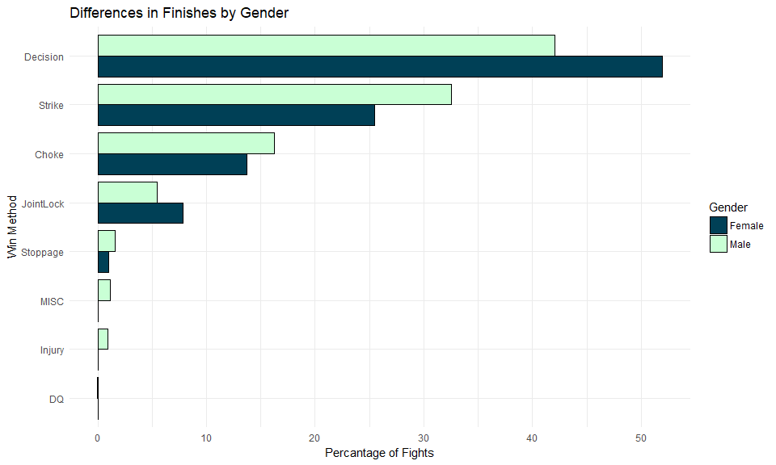

<table>
<thead>
<tr class="header">
<th align="left">Gender</th>
<th align="left">Decision</th>
<th align="left">Strike</th>
<th align="left">Choke</th>
<th align="left">JointLock</th>
<th align="left">Stoppage</th>
<th align="left">MISC</th>
<th align="left">Injury</th>
<th align="left">DQ</th>
</tr>
</thead>
<tbody>
<tr class="odd">
<td align="left">Female</td>
<td align="left">51.96</td>
<td align="left">25.49</td>
<td align="left">13.73</td>
<td align="left">7.84</td>
<td align="left">0.98</td>
<td align="left">0.00</td>
<td align="left">0.0</td>
<td align="left">0.00</td>
</tr>
<tr class="even">
<td align="left">Male</td>
<td align="left">42.09</td>
<td align="left">32.54</td>
<td align="left">16.28</td>
<td align="left">5.43</td>
<td align="left">1.57</td>
<td align="left">1.13</td>
<td align="left">0.9</td>
<td align="left">0.06</td>
</tr>
</tbody>
</table>

 

Differences in decision wins by gender
--------------------------------------

Overall, men's fights end in unanimous decisions more often in
unianimous decisions, whereby all three judges score the fight in favor
of one fighter. On the other hand, women's fights end slightly more
often in split or majority decisions, whereby two judges score the fight
for the winning fighter while the third judge scores it for the losing
fighter (split decision) or as a draw (majority decision).

 

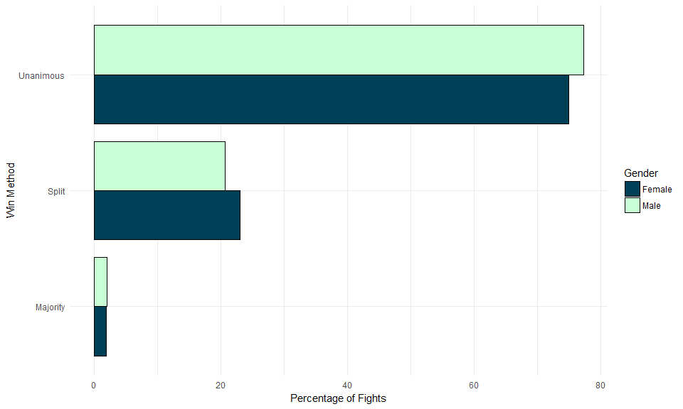

<table>
<thead>
<tr class="header">
<th align="left">Gender</th>
<th align="left">Unanimous</th>
<th align="left">Split</th>
<th align="left">Majority</th>
</tr>
</thead>
<tbody>
<tr class="odd">
<td align="left">Female</td>
<td align="left">75.0</td>
<td align="left">23.08</td>
<td align="left">1.92</td>
</tr>
<tr class="even">
<td align="left">Male</td>
<td align="left">77.3</td>
<td align="left">20.67</td>
<td align="left">2.03</td>
</tr>
</tbody>
</table>

 

Is Ring Rust Real?:
-------------------

Partially exaggerate, partially misunderstood, or partially true?

The graph below shows the average time fighters took between fights, and
whether the fighter won his/her fight. Fighters who took longer between
fights were statistically more likely to lose their next fight (p-value
&lt; 0.05).

Despite the statistical significance, there is only a miniscule
difference in average time between wins and losses (~3 weeks) and a
relatively low variability (standard error) in both groups. Therefore, I
would not conclude an additional three weeks of rest between fights will
make or break a fight!

Fighters that fought multiple times in a single event were excluded.
Statistical significance was determined using a two-sample Student's
t-test.

 

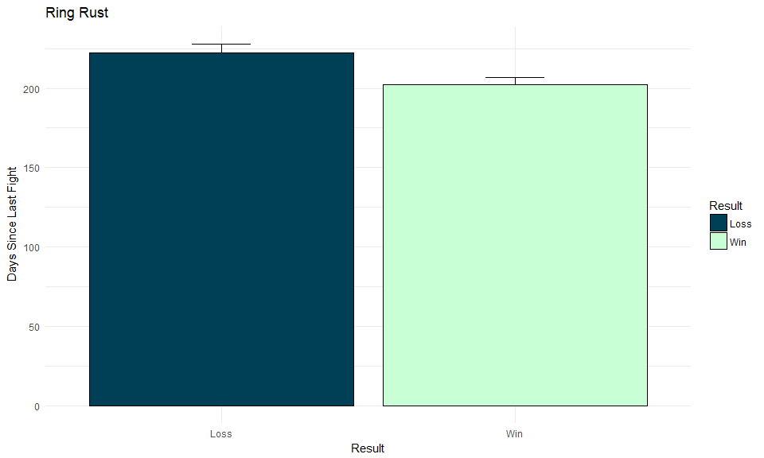

<table>
<thead>
<tr class="header">
<th align="left">Loss: Mean Days</th>
<th align="left">Win: Mean Days</th>
<th align="left">P-value</th>
</tr>
</thead>
<tbody>
<tr class="odd">
<td align="left">222.4218</td>
<td align="left">202.2848</td>
<td align="left">3.38e-03</td>
</tr>
</tbody>
</table>

 

Is There a Hometown Advantage in MMA?
-------------------------------------

Whether it's psychological or physical, fights that take place in a
fighter's home state are more likely to go in their favor. (Hometown:
57%, Away: 50%)

Hometowns were determined by the city that the fighter currently fights
and trains out of, rather than their birthplace.

 

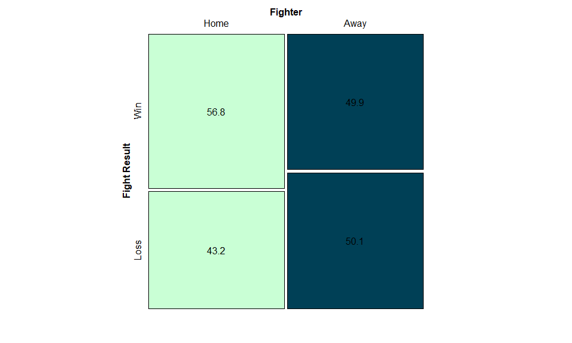

<table>
<thead>
<tr class="header">
<th></th>
<th align="left">Win</th>
<th align="left">Loss</th>
</tr>
</thead>
<tbody>
<tr class="odd">
<td>Home</td>
<td align="left">56.8</td>
<td align="left">43.2</td>
</tr>
<tr class="even">
<td>Away</td>
<td align="left">49.9</td>
<td align="left">50.1</td>
</tr>
</tbody>
</table>

 

The Land of Savages: Where do most UFC fighters come from?
----------------------------------------------------------

A quick overview of fighters locality in the UFC. Due to the large
disparity in numbers between fighters on the UFC roster from the US
compared to other countries, the two groups were examined individually.

Within the US, the vast majority of fighters come from California
(Eureka!). Outside of the US, the second largest market for UFC fighters
is Brazil, followed by Canada, the UK, and Japan.

 
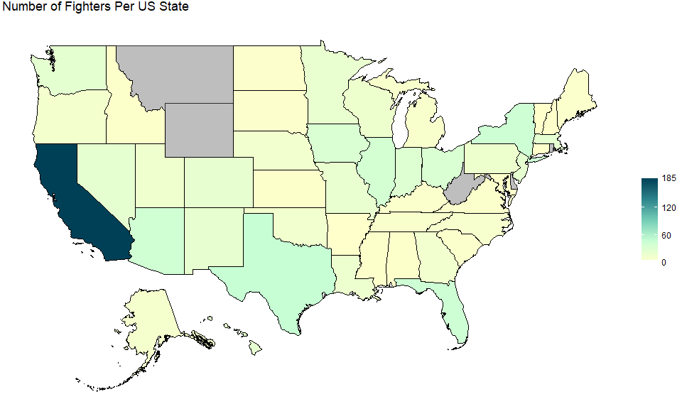

<table>
<caption>Top 10 States with most UFC Fighters</caption>
<thead>
<tr class="header">
<th align="left">State</th>
<th align="left">Number of Fighters</th>
</tr>
</thead>
<tbody>
<tr class="odd">
<td align="left">California</td>
<td align="left">185</td>
</tr>
<tr class="even">
<td align="left">Texas</td>
<td align="left">48</td>
</tr>
<tr class="odd">
<td align="left">Florida</td>
<td align="left">43</td>
</tr>
<tr class="even">
<td align="left">New York</td>
<td align="left">43</td>
</tr>
<tr class="odd">
<td align="left">Arizona</td>
<td align="left">41</td>
</tr>
<tr class="even">
<td align="left">Illinois</td>
<td align="left">39</td>
</tr>
<tr class="odd">
<td align="left">Ohio</td>
<td align="left">34</td>
</tr>
<tr class="even">
<td align="left">Iowa</td>
<td align="left">33</td>
</tr>
<tr class="odd">
<td align="left">Indiana</td>
<td align="left">31</td>
</tr>
<tr class="even">
<td align="left">Massachusetts</td>
<td align="left">25</td>
</tr>
</tbody>
</table>

 

    FALSE 58 codes from your data successfully matched countries in the map
    FALSE 6 codes from your data failed to match with a country code in the map
    FALSE 186 codes from the map weren't represented in your data

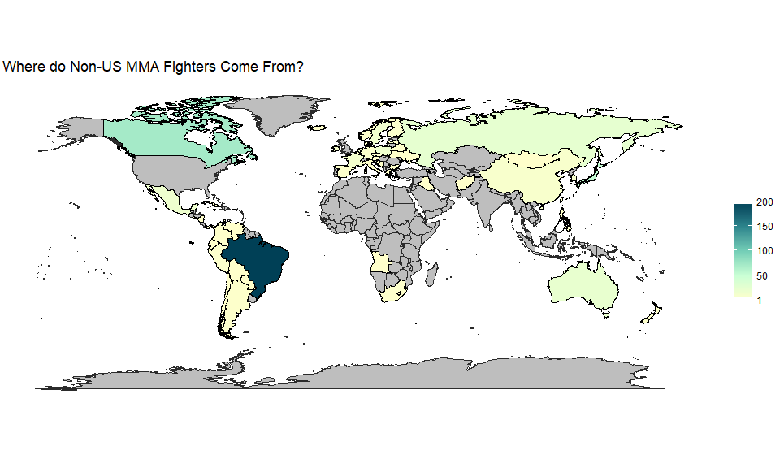

<table>
<caption>Top 10 Countries with most UFC Fighters (Excluding USA)</caption>
<thead>
<tr class="header">
<th align="left">Country</th>
<th align="left">Number of Fighters</th>
</tr>
</thead>
<tbody>
<tr class="odd">
<td align="left">Brazil</td>
<td align="left">199</td>
</tr>
<tr class="even">
<td align="left">Canada</td>
<td align="left">72</td>
</tr>
<tr class="odd">
<td align="left">United Kingdom</td>
<td align="left">61</td>
</tr>
<tr class="even">
<td align="left">Japan</td>
<td align="left">55</td>
</tr>
<tr class="odd">
<td align="left">Russia</td>
<td align="left">25</td>
</tr>
<tr class="even">
<td align="left">Australia</td>
<td align="left">23</td>
</tr>
<tr class="odd">
<td align="left">Mexico</td>
<td align="left">17</td>
</tr>
<tr class="even">
<td align="left">Poland</td>
<td align="left">17</td>
</tr>
<tr class="odd">
<td align="left">Sweden</td>
<td align="left">15</td>
</tr>
<tr class="even">
<td align="left">Netherlands</td>
<td align="left">14</td>
</tr>
</tbody>
</table>

   

Supplementary Data
==================

 

### Wins by Strikes

 

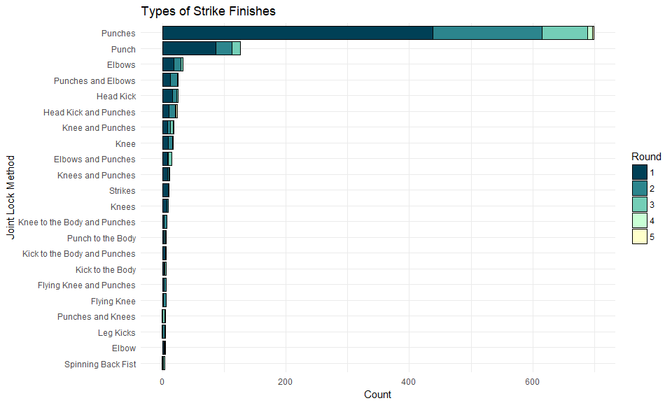

<table>
<thead>
<tr class="header">
<th align="left">Strikes</th>
<th align="left">Count</th>
</tr>
</thead>
<tbody>
<tr class="odd">
<td align="left">Punches</td>
<td align="left">699</td>
</tr>
<tr class="even">
<td align="left">Punch</td>
<td align="left">126</td>
</tr>
<tr class="odd">
<td align="left">Elbows</td>
<td align="left">33</td>
</tr>
<tr class="even">
<td align="left">Head Kick</td>
<td align="left">26</td>
</tr>
<tr class="odd">
<td align="left">Punches and Elbows</td>
<td align="left">26</td>
</tr>
<tr class="even">
<td align="left">Head Kick and Punches</td>
<td align="left">24</td>
</tr>
<tr class="odd">
<td align="left">Knee and Punches</td>
<td align="left">19</td>
</tr>
<tr class="even">
<td align="left">Knee</td>
<td align="left">18</td>
</tr>
<tr class="odd">
<td align="left">Elbows and Punches</td>
<td align="left">15</td>
</tr>
<tr class="even">
<td align="left">Knees and Punches</td>
<td align="left">12</td>
</tr>
<tr class="odd">
<td align="left">Strikes</td>
<td align="left">11</td>
</tr>
<tr class="even">
<td align="left">Knees</td>
<td align="left">10</td>
</tr>
<tr class="odd">
<td align="left">Knee to the Body and Punches</td>
<td align="left">7</td>
</tr>
<tr class="even">
<td align="left">Flying Knee</td>
<td align="left">6</td>
</tr>
<tr class="odd">
<td align="left">Flying Knee and Punches</td>
<td align="left">6</td>
</tr>
<tr class="even">
<td align="left">Kick to the Body</td>
<td align="left">6</td>
</tr>
<tr class="odd">
<td align="left">Kick to the Body and Punches</td>
<td align="left">6</td>
</tr>
<tr class="even">
<td align="left">Punch to the Body</td>
<td align="left">6</td>
</tr>
<tr class="odd">
<td align="left">Elbow</td>
<td align="left">5</td>
</tr>
<tr class="even">
<td align="left">Leg Kicks</td>
<td align="left">5</td>
</tr>
<tr class="odd">
<td align="left">Punches and Knees</td>
<td align="left">5</td>
</tr>
<tr class="even">
<td align="left">Spinning Back Fist</td>
<td align="left">4</td>
</tr>
</tbody>
</table>

 

### Wins by Choke

 

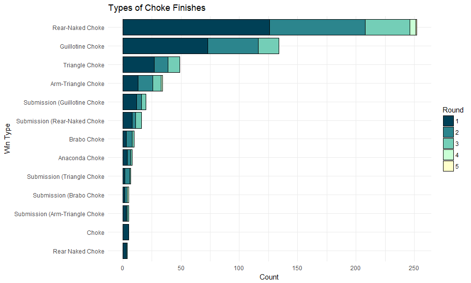

<table>
<thead>
<tr class="header">
<th align="left">Choke</th>
<th align="left">Count</th>
</tr>
</thead>
<tbody>
<tr class="odd">
<td align="left">Rear-Naked Choke</td>
<td align="left">252</td>
</tr>
<tr class="even">
<td align="left">Guillotine Choke</td>
<td align="left">134</td>
</tr>
<tr class="odd">
<td align="left">Triangle Choke</td>
<td align="left">49</td>
</tr>
<tr class="even">
<td align="left">Arm-Triangle Choke</td>
<td align="left">34</td>
</tr>
<tr class="odd">
<td align="left">Submission (Guillotine Choke</td>
<td align="left">20</td>
</tr>
<tr class="even">
<td align="left">Submission (Rear-Naked Choke</td>
<td align="left">16</td>
</tr>
<tr class="odd">
<td align="left">Brabo Choke</td>
<td align="left">10</td>
</tr>
<tr class="even">
<td align="left">Anaconda Choke</td>
<td align="left">8</td>
</tr>
<tr class="odd">
<td align="left">Submission (Triangle Choke</td>
<td align="left">7</td>
</tr>
<tr class="even">
<td align="left">Choke</td>
<td align="left">5</td>
</tr>
<tr class="odd">
<td align="left">Submission (Arm-Triangle Choke</td>
<td align="left">5</td>
</tr>
<tr class="even">
<td align="left">Submission (Brabo Choke</td>
<td align="left">5</td>
</tr>
<tr class="odd">
<td align="left">Rear Naked Choke</td>
<td align="left">4</td>
</tr>
</tbody>
</table>

 

### Wins by Joint Lock

 

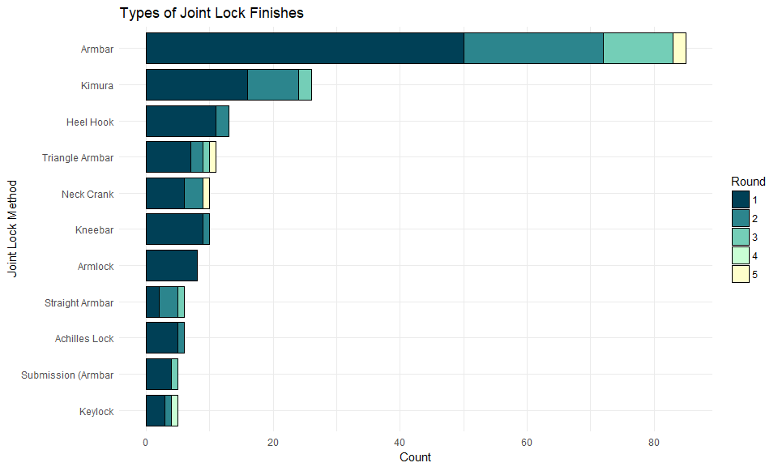

<table>
<thead>
<tr class="header">
<th align="left">Joint Lock</th>
<th align="left">Count</th>
</tr>
</thead>
<tbody>
<tr class="odd">
<td align="left">Armbar</td>
<td align="left">85</td>
</tr>
<tr class="even">
<td align="left">Kimura</td>
<td align="left">26</td>
</tr>
<tr class="odd">
<td align="left">Heel Hook</td>
<td align="left">13</td>
</tr>
<tr class="even">
<td align="left">Triangle Armbar</td>
<td align="left">11</td>
</tr>
<tr class="odd">
<td align="left">Kneebar</td>
<td align="left">10</td>
</tr>
<tr class="even">
<td align="left">Neck Crank</td>
<td align="left">10</td>
</tr>
<tr class="odd">
<td align="left">Armlock</td>
<td align="left">8</td>
</tr>
<tr class="even">
<td align="left">Achilles Lock</td>
<td align="left">6</td>
</tr>
<tr class="odd">
<td align="left">Straight Armbar</td>
<td align="left">6</td>
</tr>
<tr class="even">
<td align="left">Keylock</td>
<td align="left">5</td>
</tr>
<tr class="odd">
<td align="left">Submission (Armbar</td>
<td align="left">5</td>
</tr>
</tbody>
</table>

 

### Wins by Stoppage

 

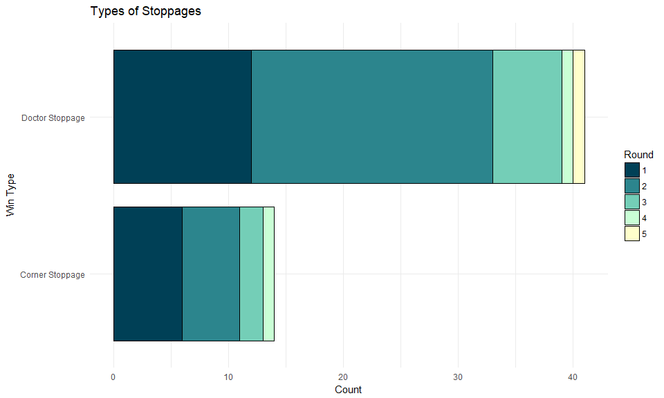

<table>
<thead>
<tr class="header">
<th align="left">Stoppage</th>
<th align="left">Count</th>
</tr>
</thead>
<tbody>
<tr class="odd">
<td align="left">Doctor Stoppage</td>
<td align="left">41</td>
</tr>
<tr class="even">
<td align="left">Corner Stoppage</td>
<td align="left">14</td>
</tr>
</tbody>
</table>

 

### Wins by Miscellaneous Methods

 

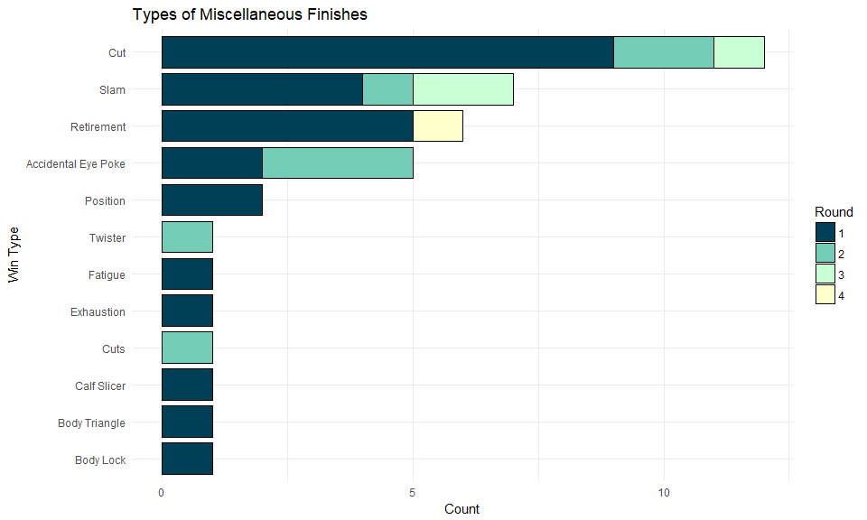

<table>
<thead>
<tr class="header">
<th align="left">Misc Finish</th>
<th align="left">Count</th>
</tr>
</thead>
<tbody>
<tr class="odd">
<td align="left">Cut</td>
<td align="left">12</td>
</tr>
<tr class="even">
<td align="left">Slam</td>
<td align="left">7</td>
</tr>
<tr class="odd">
<td align="left">Retirement</td>
<td align="left">6</td>
</tr>
<tr class="even">
<td align="left">Accidental Eye Poke</td>
<td align="left">5</td>
</tr>
<tr class="odd">
<td align="left">Position</td>
<td align="left">2</td>
</tr>
<tr class="even">
<td align="left">Body Lock</td>
<td align="left">1</td>
</tr>
<tr class="odd">
<td align="left">Body Triangle</td>
<td align="left">1</td>
</tr>
<tr class="even">
<td align="left">Calf Slicer</td>
<td align="left">1</td>
</tr>
<tr class="odd">
<td align="left">Cuts</td>
<td align="left">1</td>
</tr>
<tr class="even">
<td align="left">Exhaustion</td>
<td align="left">1</td>
</tr>
<tr class="odd">
<td align="left">Fatigue</td>
<td align="left">1</td>
</tr>
<tr class="even">
<td align="left">Twister</td>
<td align="left">1</td>
</tr>
</tbody>
</table>

### Wins by Injury

 

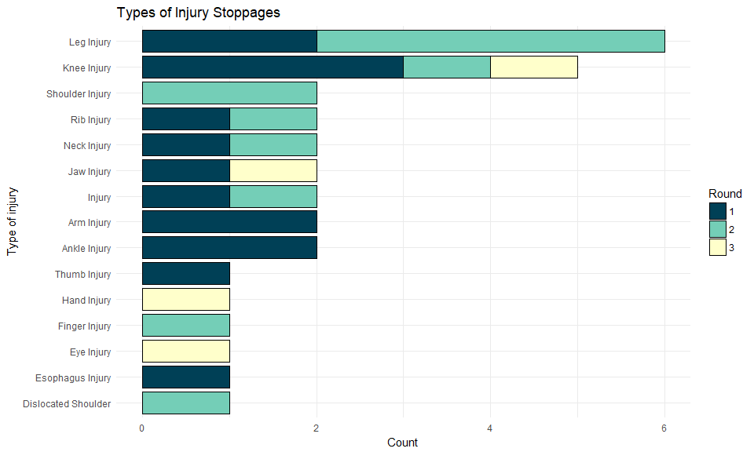

<table>
<thead>
<tr class="header">
<th align="left">Injury</th>
<th align="left">Count</th>
</tr>
</thead>
<tbody>
<tr class="odd">
<td align="left">Leg Injury</td>
<td align="left">6</td>
</tr>
<tr class="even">
<td align="left">Knee Injury</td>
<td align="left">5</td>
</tr>
<tr class="odd">
<td align="left">Ankle Injury</td>
<td align="left">2</td>
</tr>
<tr class="even">
<td align="left">Arm Injury</td>
<td align="left">2</td>
</tr>
<tr class="odd">
<td align="left">Injury</td>
<td align="left">2</td>
</tr>
<tr class="even">
<td align="left">Jaw Injury</td>
<td align="left">2</td>
</tr>
<tr class="odd">
<td align="left">Neck Injury</td>
<td align="left">2</td>
</tr>
<tr class="even">
<td align="left">Rib Injury</td>
<td align="left">2</td>
</tr>
<tr class="odd">
<td align="left">Shoulder Injury</td>
<td align="left">2</td>
</tr>
<tr class="even">
<td align="left">Dislocated Shoulder</td>
<td align="left">1</td>
</tr>
<tr class="odd">
<td align="left">Esophagus Injury</td>
<td align="left">1</td>
</tr>
<tr class="even">
<td align="left">Eye Injury</td>
<td align="left">1</td>
</tr>
<tr class="odd">
<td align="left">Finger Injury</td>
<td align="left">1</td>
</tr>
<tr class="even">
<td align="left">Hand Injury</td>
<td align="left">1</td>
</tr>
<tr class="odd">
<td align="left">Thumb Injury</td>
<td align="left">1</td>
</tr>
</tbody>
</table>
